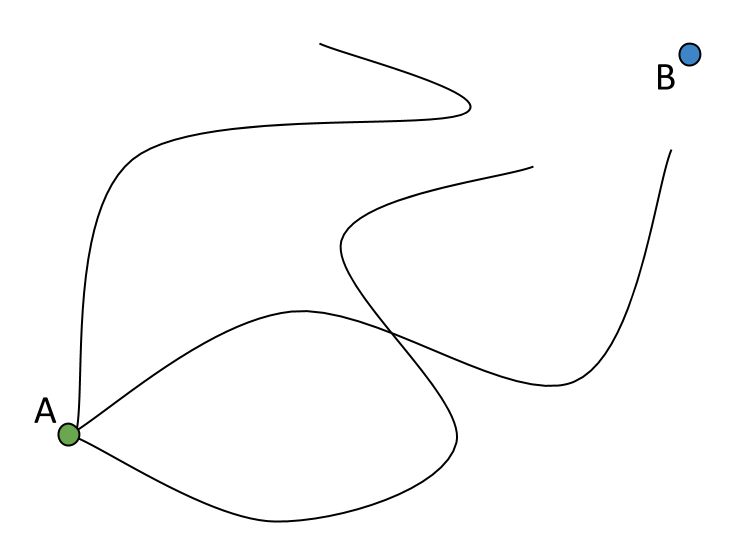
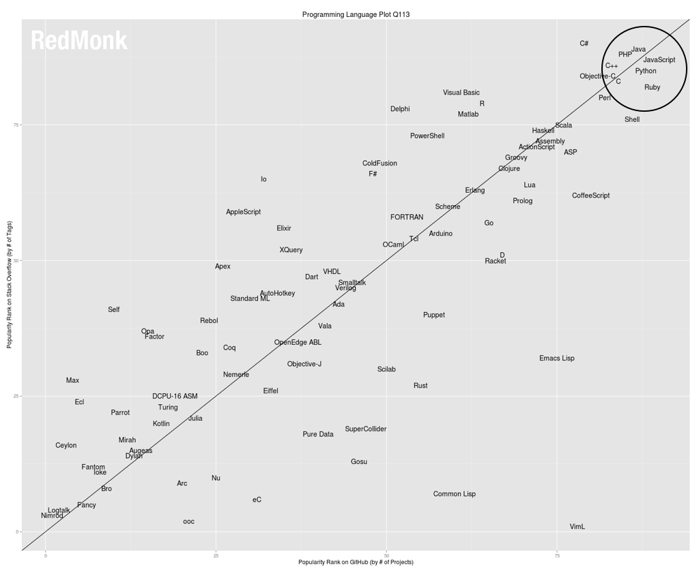
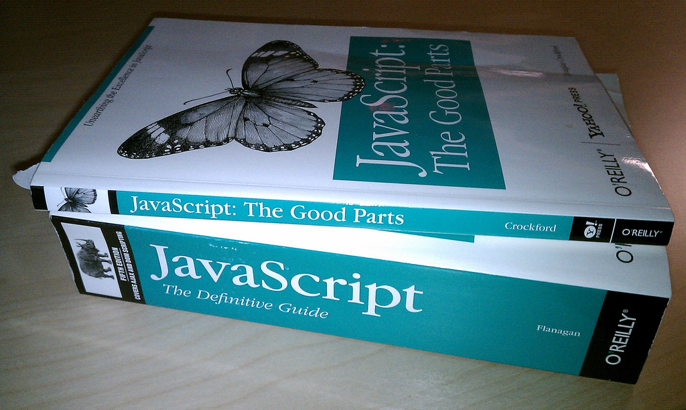
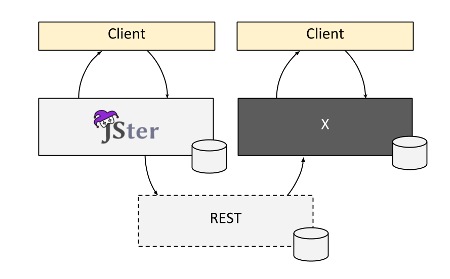

title: What's in Store?
class: big
build_lists: true

- Web Development Strategies
    * How Did We Get Here
    * Where Are We Now
    * Where Are We Headed
- JavaScript Tricks
    * Node.js
    * Editors
    * Finding Libraries
    * Structuring Code
    * Testing
- Phew
    * Surprise!

---

title: Web Development Strategies
class: segue dark nobackground

---

title: Strategy for Goldfishes

<footer class="source"><a href="http://www.flickr.com/photos/hikingartist/3000884576">HikingArtist.com</a> (CC BY-NC-ND) </footer>

---

title: Strategy for the Rest of Us
notes. ["About what, not how", "From A (now) to B (future)"]

---

title: How Did We Get Here
class: segue dark nobackground

---

title: Ten Days to JavaScript
class: big
build_lists: true

- 1995 - Brendan Eich's ten days &rarr; Mocha
- Known as LiveScript till the marketing folks changed the name
- Even though has Java in name, completely different
- Influence of Java 1.0 visible mainly in Math and Time modules
- Prototypal inheritance a lá Self
- Dynamic, flexible, lambdas
- Scheme in disguise - See [The Little JavaScripter](http://www.crockford.com/javascript/little.html) by Crockford

---

title: A Bit of JavaScript

<pre class="prettyprint" data-lang="javascript">
var helloAgileJkl = hello.bind(undefined, 'AgileJkl!');

helloAgileJkl();

function hello(target) {
    console.log('Hello ' + target);
}

// or could just console.log('Hello AgileJkl!');
// to avoid over-engineering!
</pre>

---

title: Web - From Documents to Applications
class: big
build_lists: true

- Web as a Document Platform
    * 1995 - Brendan Eich's ten days
    * 1999 - ES3 (modern baseline), Mozilla established
- Improved Interactivity
    * 2005 - AJAX, dynamic loading (search for instance)
    * 2008 - RIP ES4, parts of HTML5 emerge, Chrome (V8) introduced
    * 2009 - ES5 (Modern browsers IE9 included), Chrome OS, Node.js
- Web as an Application Platform
    * 2012 - HTML5 well supported (interesting JS APIs)
    * 2013 - ES6?

<footer class="source"><a href="http://brendaneich.github.io/Strange-Loop-2012/#/1">Brendan Eich at Strange Loop '12</a></footer>

---

title: JavaScript Has Traction

<footer class="source"><a href="http://redmonk.com/sogrady/2013/02/28/language-rankings-1-13/">Redmonk</a></footer>

---

title: Crockford

<footer class="source"><a href="http://www.flickr.com/photos/equanimity/4206032023/">superfluity</a> (CC BY-NC-SA)</footer>

---

title: The Good Parts vs. The Rest

<footer class="source"><a href="http://www.flickr.com/photos/nathansmith/4704268314/">Oльга + Haфaн (CC BY)</a></footer>

---

title: Recap
class: big
build_lists: true

- JavaScript, an unlikely winner
- Language of the web
- More powerful than it seems
- Web isn't just about documents, now applications too

---

title: Where Are We Now
class: segue dark nobackground

---

title: Elements of Web Applications

---

title: Logic
class: segue dark nobackground

---

content_class: flexbox vcenter bigText

# JavaScript

---

title: CoffeeScript

<iframe src="http://coffeescript.org/"></iframe>

---

title: Dart

<iframe src="http://www.dartlang.org/"></iframe>

---

title: TypeScript

<iframe src="http://www.typescriptlang.org/"></iframe>

---

title: And many others
content_class: flexbox vcenter bigText

# [altJS](http://altjs.org/)

---

title: Markup
class: segue dark nobackground

---

content_class: flexbox vcenter bigText

# HTML

---

title: Jade

<iframe src="http://jade-lang.com/"></iframe>

---

title: Mustache

<iframe src="http://mustache.github.io/"></iframe>

---

title: Handlebars

<iframe src="http://handlebarsjs.com/"></iframe>

---

title: Transparency

<iframe src="http://leonidas.github.io/transparency/"></iframe>

---

title: Styling
class: segue dark nobackground

---

content_class: flexbox vcenter bigText

# CSS

---

title: LESS

<iframe src="http://lesscss.org/"></iframe>

---

title: SASS

<iframe src="http://sass-lang.com/"></iframe>

---

title: Responsive Web Design

<iframe src="http://finecitizens.com/defineResponsive/"></iframe>

---

title: Twitter Bootstrap

<iframe src="http://twitter.github.io/bootstrap/"></iframe>

---

title: Zurb Foundation

<iframe src="http://foundation.zurb.com/"></iframe>

---

title: Data
class: segue dark nobackground

---

title: Data
class: big
build_lists: true

- Usually handled with a backend or external services (Disqus for comments for example)
- RESTful interfaces (client-side MVC)
- Local caching (localStorage ie.)
- Offline usage (replication, PouchDB)

---

title: Big Data

<footer class="source"><a href="http://www.flickr.com/photos/89334594@N07/8450190120/">infocux Technologies (CC BY-NC)</a></footer>

---

title: Recap
class: big

> Logics are violet

> Markups are blue

> Styling is sweet

> And so is data

---

title: Where Are We Headed
class: segue dark nobackground

---

title: Enlightenment

<footer class="source"><a href="http://www.flickr.com/photos/michaelheiss/452908317/">michael.heiss</a> (CC BY-NC-SA)</footer>

---

<footer class="source"><a href="http://www.flickr.com/photos/augie/77419568/">Augie Schwer</a> (CC BY-SA)</footer>

---

<footer class="source"><a href="http://www.flickr.com/photos/59023810@N00/455252569/">letmehearyousaydeskomdeskom</a> (CC BY-SA)</footer>

---

title: caniuse.com

<iframe src="http://caniuse.com/"></iframe>

---

title: Shim
class: big

> a thin often tapered piece of material (as wood, metal, or stone) used to fill in space between things (as for support, leveling, or adjustment of fit)

<footer class="source"><a href="http://www.merriam-webster.com/dictionary/shim">Merriam-Webster</a></footer>
<footer class="source"><a href="http://www.flickr.com/photos/7357861@N03/2339001640/">esagor</a> (CC BY-NC)</footer>

---

<footer class="source"><a href="http://www.flickr.com/photos/46307289@N00/2093478809/">T.R.G.</a> (CC BY-NC-SA)</footer>

---

title: Rise of the Mobile
class: segue dark nobackground

---

title: Android
class: big

<footer class="source"><a href="http://www.flickr.com/photos/19953384@N00/3750802591/">San Diego Shooter</a> (CC BY-NC-ND)</footer>

---

<footer class="source"><a href="http://www.flickr.com/photos/44124462151@N01/4923953409/">Brian LeRoux</a> (CC BY-NC-SA)</footer>

---

content_class: flexbox vcenter bigText

## Firefox OS, Jolla etc.

---

title: Web Architectures
class: segue dark nobackground

---

title: Blog (Static Site)

---

title: JSter (Portal)

---

title: Future JSter?

---

title: Other Considerations
class: big
build_lists: true

- What belongs to server, what to client and why (business goals)
- [Client-side MVC is not a silver bullet](http://mir.aculo.us/2013/02/26/client-side-mvc-is-not-a-silver-bullet/)
- [Basecamp's experiences](http://37signals.com/svn/posts/3112-how-basecamp-next-got-to-be-so-damn-fast-without-using-much-client-side-ui) (hint: pushState, aggressive caching, minimal client)
- Synchronization, offline-usage (mobile apps), skills, time, budget...
- A bit like fashion. New techs come and go. Different answer each time you ask.
- Up and coming? [Meteor](http://meteor.com/), [Derby](http://derbyjs.com/)

---

title: Recap
class: big
build_lists: true

- Web dev is as hard as you make it
- Especially on the bleeding edge
- Fortunately a bit of tape fixes anything
- Mobile on the rise, native HTML5 apps not mainstream yet
- Web architectures - from monoliths to distributed

---

title: JavaScript Tricks
class: segue dark nobackground

---

title: Node.js
class: segue dark nobackground

---

title: Node.js
class: big
build_lists: true

- JavaScript on backend!
- Development started in 2009 by Ryan Dahl
- Enabled by Google's V8
- Excellent for prototyping
- Strong ecosystem ([NPM](https://npmjs.org/))
- Develops at a blistering pace

---

title: Packages per Year
class: big
build_lists: true

- Python: 29,720 packages / 22 years = *1351* packages per year
- Ruby: 54,385 packages / 18 years = *3022* packages per year
- Node.js: 26,966 packages / 4 years = *6742* packages per year

<footer class="source"><a href="http://caines.ca/blog/programming/the-node-js-community-is-quietly-changing-the-face-of-open-source/">Gregg Gaines</a></footer>

---

title: Trends

<footer class="source"><a href="http://goo.gl/NBFnd">Google Trends</a></footer>

---

title: Server Using Callbacks
class: big
build_lists: true

<pre class="prettyprint" data-lang="javascript">
var http = require('http');

http.createServer(
    function(req, res) {
        res.writeHead(200, {'Content-Type': 'text/plain'});
        res.end('Hello AgileJkl!\n');
    }
).listen(8000);
</pre>

- Short and sweet
- [Express](http://expressjs.com/) is very popular for more complex cases

---

title: Server Using EventStreams
class: big
build_lists: true

<pre class="prettyprint" data-lang="javascript">
var http = require('http');

var s = new http.Server();

s.on('request', function(req, res) {
    res.writeHead(200, {'Content-Type': 'text/plain'});
    res.end('Hello AgileJkl!\n');
});

s.listen(8000);
</pre>

- Viable alternative to callbacks at times
- More info at [Node.js: Patterns and Opinions](https://dl.dropboxusercontent.com/u/3685/presentations/node-patterns/node-patterns.pdf) by @izs (the Node guy)

---

title: Editors
class: segue dark nobackground

---

title: Editors
class: big
build_lists: true

- Regular development: Plain old IDE or editor
- LiveReload
- Prototyping: Web based service (jsfiddle, jsbin)
- Future is in the web? Cloud9?
- Continuous integration (travis and such)
- Browserify etc. (cross-browser issues)

---

title: Finding Libraries
class: segue dark nobackground

---

title: NPM

<iframe src="https://npmjs.org/"></iframe>

---

title: Bower

<iframe src="http://sindresorhus.com/bower-components/"></iframe>

---

title: JSwiki

<iframe src="http://jswiki.org"></iframe>

---

title: JSter

<iframe src="http://jster.net/"></iframe>

---

title: Structuring Code
class: segue dark nobackground

---

title: Current Status
class: big
build_lists: true

* No official module system (yet)
* Supposedly ES6 will bring one
* Still, it will remain as a compile target

---

title: The Anti-Pattern
class: big
build_lists: true

<pre class="prettyprint" data-lang="html">
&lt;script src='jquery-current.js' type='text/javascript'&gt;&lt;/script&gt;
&lt;script src='sorttable.js'      type='text/javascript'&gt;&lt;/script&gt;
&lt;script src='scripts.js'        type='text/javascript'&gt;&lt;/script&gt;
&lt;script src='miniCalendar.js'   type='text/javascript'&gt;&lt;/script&gt;
</pre>

* Each include has to be defined by hand
* Brittle and prone to error, especially with large codebases
* Does not encourage to modularity
* Hard to reuse

---

title: Concatenate Scripts
class: big
build_lists: true

<pre class="prettyprint" data-lang="html">
&lt;script src='application.js' type='text/javascript'&gt;&lt;/script&gt;
</pre>

* Old skool but works
* Less overhead at HTML
* Still, running into dependency order problem at concatenation
* Possible to complement by loading scripts (ie. jQuery) from a CDN
* Nevertheless a step forward

---

title: RequireJS and AMD + Bower
class: big
build_lists: true

<pre class="prettyprint" data-lang="html">
&lt;script data-main="scripts/main" src="scripts/require.js"&gt;&lt;/script&gt;
</pre>

<pre class="prettyprint" data-lang="javascript">
define(['jquery', './math'], function($, math) {
    return { // exports
        vector: function() {...}
    };
});
</pre>

* Modular, asynchronous approach
* Includes `define` overhead (possible to mimic Node.js convention, though)
* Optimizer resolves dependencies and creates build (loadable with Almond)
* Configuration complex at times

---

title: Browserify + NPM
class: big
build_lists: true

<pre class="prettyprint" data-lang="html">
&lt;script src='application.js' type='text/javascript'&gt;&lt;/script&gt;
</pre>

<pre class="prettyprint" data-lang="javascript">
var $ = require('jquery');
var math = require('./math');

exports.vector = function() {...};
</pre>

* Allows to use Node.js module convention (CJS)
* Better yet allows to hook into NPM ecosystem!
* Still fairly bleeding edge

---

title: Testing
class: segue dark nobackground

---

title: Browserling

<iframe src="http://ci.testling.com/"></iframe>

---

title: Browserstack

<iframe src="http://www.browserstack.com/"></iframe>

---

title: Travis

<iframe src="http://about.travis-ci.org/"></iframe>

---

title: AB Testing
notes: ["Optimizely"]

<footer class="source"><a href="http://www.flickr.com/photos/26176646@N04/2492945625/">TheBusyBrain</a> (CC BY)</footer>

---

content_class: flexbox vcenter bigText

# WTFs/min

---

title: Money

---

title: Conclusions
class: segue dark nobackground

---

title: Conclusions

TODO

